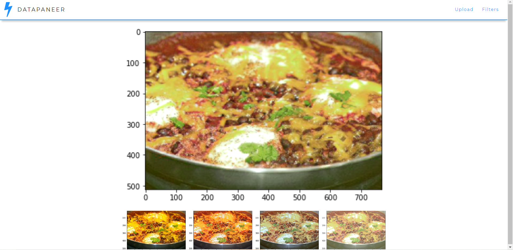

### DataPaneer

##### DefHacks 2020 Submission | [DevPost](https://devpost.com/software/datapaneer)| [YouTube](https://www.youtube.com/watch?v=IybTefxD1sc) |

<b>Collaborators</b>: [Siddhartha Datta](https://github.com/dattasiddhartha/), [Vikram Sambamurthy](https://github.com/v97)

</img>
</img>

The goal of our project is find new ways to titillate the taste buds of our users and keep them entertained during the onset of COVID-19. Cooking at home is a fulfilling way to spend time, and we wanted to make this accessible for anybody by recommending to them different recipes that they could try, which are not out of their skill level or taste.

#### How it works
Users enter the site, filter dishes based on their dietary or nutritional needs. Users can select among a gallery of dishes, and clicking a dish will return variations of that specific dish. Variations can be generated by neural style transfer or generative adversarial networks (cycleGAN), based on physical appeal. Users can click the dish they wish to cook, and based on a multi-input-multi-output model trained on (images, [ingredients, recipe]) pairs, we can reverse-engineer the steps needed to recreate the dish. 

#### Roadmap to this product
* Scraped food data (image, ingredients, health information) from allrecipes.com
* Recipe recommendation engine
* Food style/variations generation (food style transfer)
* Recipe generation (image → list of ingredients reverse engineering)
* Web app

#### Weights and Data

Weights can be downloaded from [here](https://drive.google.com/drive/folders/1Suq1pMC7chu1uKcS_vpeQEh0g2og8WBM?usp=sharing).

Data for training CycleGAN: [[food]](https://github.com/karansikka1/iFood_2019)

#### Food Style Transfer

Style weights stored in `./fast_neural_style_transfer/models`.

#### CycleGAN

Place data in `./datasets/` with image set pairs as `trainA` and `trainB` for training. Training time can go up to 13hrs per food mask, tested on GTX1070.

##### Development server

Run python server using `python app.py` command
